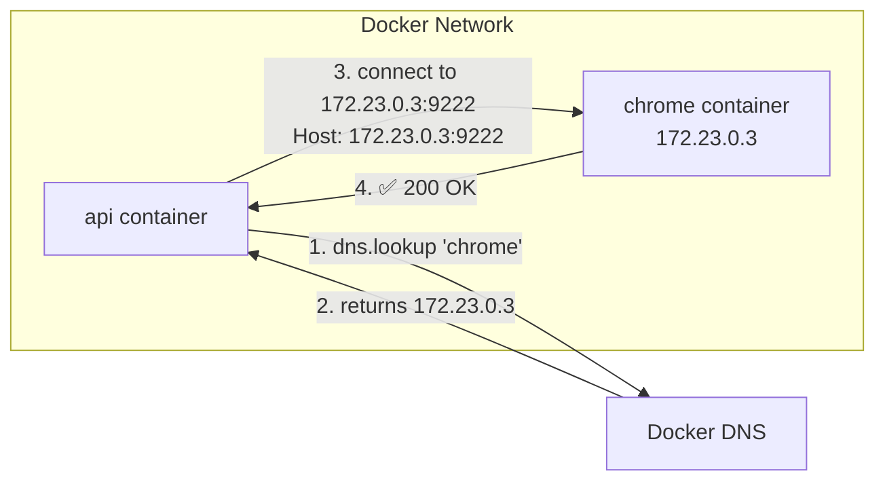
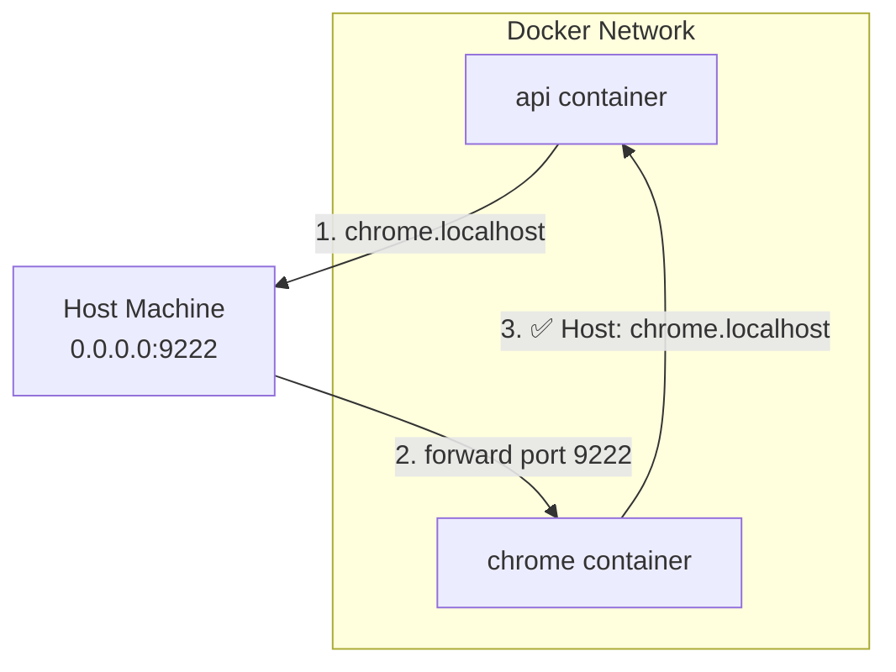
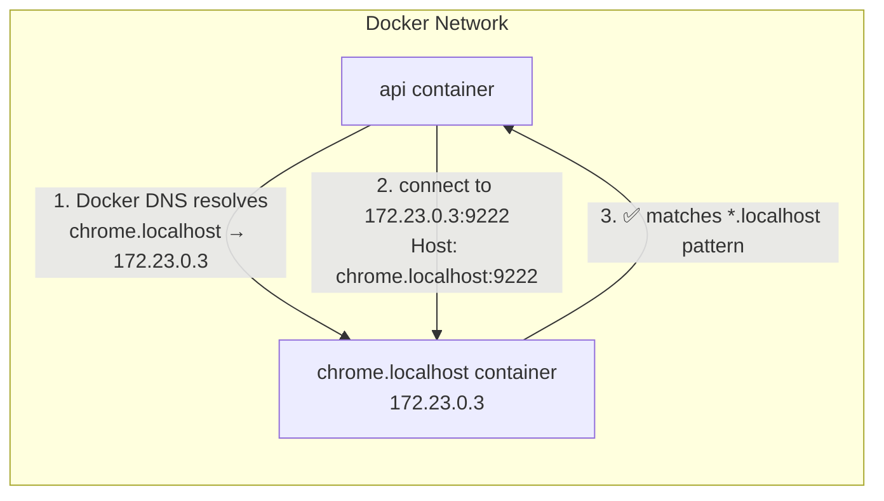

# Why Playwright Can't Connect to Chrome in Docker (And the One-Line Fix)

## The Problem

**5 ways to frame this issue:**
- Playwright `connectOverCDP` fails with HTTP 500 in Docker
- Chrome DevTools rejects connections from containerized apps
- "This does not look like a DevTools server" error in Docker Compose
- Headless Chrome returns 500 on `/json/version` endpoint
- Browser automation breaks when using Docker service names

**Symptoms:**
- `browserType.connectOverCDP: Unexpected status 500`
- Works with IP address, fails with hostname
- Works locally, fails in Docker

---

## The Initial Workaround: DNS Resolution

**What developers often try first:**
- Manually resolve hostname → IP before connecting
- Pass IP address to Playwright instead of service name
- Assume it's an Alpine/musl DNS issue (it's not)

**The workaround code:**
```typescript
const { address } = await dns.promises.lookup("chrome");
await chromium.connectOverCDP(`http://${address}:9222`);
```

**Docker network with DNS resolution:**



**Why it works:**
- Host header contains IP address
- Chrome allows IP addresses

**Why it's not ideal:**
- Extra code complexity
- Obscures the real problem
- Misleading comments about "DNS issues"

---

## The Root Cause

**Chrome security feature (since Chrome 66, 2018):**
- DevTools HTTP server validates `Host` header
- Rejects hostnames that aren't IP or `*localhost`
- Prevents DNS rebinding attacks
- Reference: `crbug.com/813540`

**Allowed Host headers:**
- `127.0.0.1:9222` ✅
- `172.23.0.3:9222` ✅
- `localhost:9222` ✅
- `foo.localhost:9222` ✅
- `chrome:9222` ❌
- `my-browser:9222` ❌

---

## Researched Solutions

**1. DNS resolution in code:**
- Resolve hostname → IP programmatically
- Direct container-to-container networking
- Requires code changes

**2. Upgrade Playwright:**
- Some `connectOverCDP` bugs fixed in newer versions
- Not the root cause here

**3. Use WebSocket URL directly:**
- Fetch `/json/version` manually
- Connect via `chromium.connect(wsUrl)`
- More complex, same underlying issue

**4. Switch Chrome image:**
- Try vanilla Chromium instead of alpine-chrome
- Doesn't fix the Host header issue

---

## Not Yet Explored

- Chromium build flags to disable Host validation
- Reverse proxy (nginx) to rewrite Host header
- Custom Chrome wrapper script

---

## The resolveToIp Method

```typescript
/**
 * Resolves a URL's hostname to an IP address.
 *
 * Chrome's DevTools HTTP server rejects requests where the Host header
 * contains a non-IP hostname (e.g., "chrome:9222" returns HTTP 500).
 * This is a security feature to prevent DNS rebinding attacks.
 *
 * We resolve the hostname to IP so the Host header contains an IP address,
 * which Chrome accepts.
 *
 * Reference: https://bugs.chromium.org/p/chromium/issues/detail?id=813540
 */
async function resolveToIp(url: string): Promise<string> {
  const parsed = new URL(url);

  // Skip if already localhost or IP
  if (
    parsed.hostname === "localhost" ||
    parsed.hostname === "127.0.0.1" ||
    /^\d+\.\d+\.\d+\.\d+$/.test(parsed.hostname)
  ) {
    return url;
  }

  const { address } = await dns.promises.lookup(parsed.hostname);
  parsed.hostname = address;
  return parsed.toString();
}
```

---

## The Actual Solution

### Part 1: extra_hosts with host-gateway

**Docker Compose config:**
```yaml
services:
  api:
    environment:
      BROWSER_WEB_URL: http://chrome.localhost:9222
    extra_hosts:
      - "chrome.localhost:host-gateway"

  chrome:
    ports:
      - "9222:9222"  # Required!
```

**Network flow (hairpin routing):**



**Downsides:**
- Requires port exposure
- Indirect routing (hairpin NAT)
- Extra latency

### Part 2: The Clever Service Name (Recommended)

**Docker Compose config:**
```yaml
services:
  api:
    environment:
      BROWSER_WEB_URL: http://chrome.localhost:9222
    depends_on:
      - chrome.localhost

  chrome.localhost:  # ← The magic!
    image: gcr.io/zenika-hub/alpine-chrome:124
```

**Network flow (direct):**



**Why it works:**
- Docker allows dots in service names
- Docker DNS resolves `chrome.localhost` → container IP
- Host header is `chrome.localhost:9222`
- Chrome allows `*.localhost` pattern

**Advantages:**
- Zero code changes
- Zero extra config
- Direct container-to-container networking
- Self-documenting service name

---

## Comparison Table

| Solution | Code Changes | Config Changes | Network | Complexity |
|----------|--------------|----------------|---------|------------|
| DNS resolution | Add function | None | Direct | Medium |
| extra_hosts | None | extra_hosts, ports | Hairpin | High |
| **Service name *.localhost** | **None** | **Rename service** | **Direct** | **Low ✨** |

---

## Other Use Cases for *.localhost Service Names

**Any scenario where a service validates the Host header:**
- Webpack dev server with host checking
- Development CORS restrictions
- OAuth callback URL validation
- Certificate validation for localhost
- Browser security features (secure contexts)
- WebSocket origin validation

**Examples:**
- `postgres.localhost` - database with host restrictions
- `redis.localhost` - cache server
- `api.localhost` - backend with CORS
- `auth.localhost` - OAuth server

---

## Key Takeaways

- Not a DNS issue — it's Chrome's security feature
- Chrome allows: IP addresses, `localhost`, `*.localhost`
- Simplest fix: name your service `something.localhost`
- Zero code changes, zero extra config
- Works with any Chrome-based browser automation
